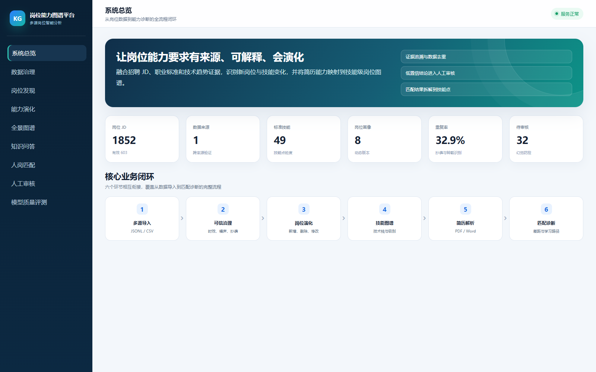
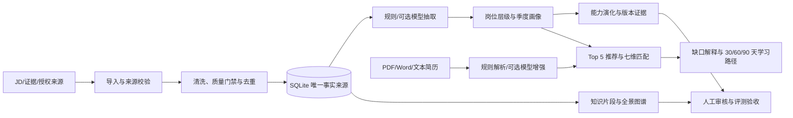

# 岗位能力图谱与动态演化分析平台

面向新一代信息技术岗位的“多源数据治理 + 岗位能力图谱 + 动态演化 + 人岗匹配”系统。项目把岗位 JD、职业标准和技术证据转化为可追溯的岗位画像与技能图谱，并支持简历解析、Top 5 岗位推荐、七维匹配和 30/60/90 天学习路径。

> 当前阶段：核心业务闭环和自动化测试已完成；正式数据规模、来源均衡度、新岗位样板和独立标注评测集仍未达标。详见 [项目总览与当前完成情况](docs/PROJECT_OVERVIEW.md)。



上图为 2026 年 7 月的历史演示截图，页面数字不代表当前数据库。2026 年 8 月 21 日的可复核数字以下文“当前结果”为准。

## 核心能力

- JSON、JSONL、CSV 岗位数据导入，以及受控公开来源/授权文件接入。
- 来源规范化、字段校验、SHA-256 精确去重和 SimHash 近重复治理。
- 规则技能抽取、技能别名标准化和可选 DeepSeek 证据约束抽取。
- 岗位层级、季度画像、版本链和相邻季度能力演化。
- 岗位—技能—职责—场景—版本—证据全景图谱，可选同步 Neo4j。
- 词法/可选混合检索、引用校验和无模型摘要降级。
- PDF、DOCX、TXT、Markdown 简历解析，默认使用本地规则。
- 七维人岗匹配、岗位族去重 Top 5 推荐和分阶段学习路径。
- 人工审核、离线指标评测、覆盖率门禁和系统验收快照。
- 无前端构建步骤的单页演示界面，以及 Docker Compose 部署。

## 端到端流程



详细组件、代码入口和四条调用链见 [系统架构与代码运行流程](docs/ARCHITECTURE_AND_FLOW.md)。

## 当前结果

基线日期：2026 年 8 月 21 日。

| 指标 | 当前值 | 解释 |
| --- | ---: | --- |
| 自动化测试 | 1,021 passed，6 skipped | 完整测试集 |
| 代码覆盖率 | 87.21% | 已通过 60% 门禁 |
| 岗位记录 | 2,568 | 数据库总记录 |
| 可用唯一岗位 | 1,318 | 质量门禁和语义去重后的验收口径 |
| 岗位族 | 18 | 内部目标 22 |
| 技能 | 49 | 标准技能实体 |
| 岗位画像 | 70 | 分层/季度/版本化画像 |
| 演化事件 | 492 | 新增、删除或变化事件 |
| 知识片段 | 2,077 | 可检索岗位知识 |

最近验收总状态仍为 `failed`，主要差距是：有效岗位未达到 5,000 条、来源过于集中、部分岗位族样本不足、正式新岗位样板缺失，以及独立真实标注集不足。

数据库中的示例评测 Accuracy 为 1.0，但每类只有 1–2 个样本；这只能证明评测流程可运行，不能表述为“模型正式准确率 100%”。

## 快速开始

### Windows PowerShell

```powershell
python -m venv .venv
.venv\Scripts\Activate.ps1
pip install -r requirements.txt
Copy-Item .env.example .env
python -m uvicorn src.api:app --reload --port 8000
```

访问：

- 系统页面：`http://127.0.0.1:8000`
- API 文档：`http://127.0.0.1:8000/docs`
- 健康检查：`http://127.0.0.1:8000/health`

DeepSeek 密钥不是启动必需项。未配置密钥时，规则抽取、数据治理、画像、演化、图谱、简历解析、匹配推荐和评测仍可运行。

### 初始化示例数据

```powershell
python -m src.build_knowledge_base .\data\samples\jobs.jsonl
```

新仓库不包含生产主数据库。首次启动统计为 0 属于正常情况，导入示例或通过团队内部受控渠道取得数据库副本即可。

### Docker Compose

```powershell
Copy-Item .env.example .env
docker compose up --build -d
```

Docker 配置会同时启动 API 和 Neo4j。Neo4j 是可选图存储副本，SQLite 才是唯一事实来源。

完整步骤和常见问题见 [环境配置、运行与部署](docs/ENVIRONMENT_AND_DEPLOYMENT.md)。

## 测试

发布前完整门禁：

```powershell
python -m pytest -c pytest-full.ini -q
```

预期覆盖率不低于 60%。本文记录的最近结果为 1,021 项通过、6 项跳过、覆盖率 87.21%。

## 典型演示顺序

1. 在“系统总览”说明数据、岗位、技能、画像和审核状态。
2. 在“数据治理”展示来源、批次、去重、复核和隔离。
3. 在“岗位发现/能力演化”展示季度画像和版本证据。
4. 在“全景图谱”筛选岗位族、层级和技能关系。
5. 在“知识问答”验证回答包含来源引用或合理拒绝。
6. 上传简历并生成 Top 5 推荐。
7. 查看七维匹配、能力缺口和学习路径。
8. 展示审核队列、自动化测试和评测边界。
9. 最后坦诚说明数据规模、正式标注和来源均衡度的剩余工作。

可用于 PPT 的截图存放在 `docs/assets/screenshots/`。这些截图来自 2026 年 7 月的历史演示，引用其中数字时必须替换为当前实测值或注明截图日期。

## 主要接口

| 接口 | 用途 |
| --- | --- |
| `POST /api/data/import` | 导入岗位 JD |
| `POST /api/data/evidence/import` | 导入外部证据 |
| `GET /api/data/stats` | 数据与质量统计 |
| `POST /api/hard-metrics/rebuild` | 重建去重、门禁、画像、演化和验收 |
| `GET /api/analysis/quarterly-profiles` | 查询季度分层画像 |
| `GET /api/analysis/evolution/{family}` | 查询岗位能力演化 |
| `GET /api/graph` | 获取全景图谱 |
| `POST /api/graph/sync` | 可选同步 Neo4j |
| `GET /api/knowledge/search` | 检索知识片段和来源 |
| `POST /api/knowledge/answer` | 生成带证据回答或摘要降级 |
| `POST /api/resumes/parse` | 解析简历 |
| `POST /api/matches/recommend` | Top N 岗位推荐 |
| `POST /api/matches` | 单岗位七维匹配 |
| `GET /api/reviews` | 查询人工审核队列 |
| `POST /api/evaluation/run` | 运行离线评测 |
| `GET /api/acceptance/summary` | 查询当前验收差距 |

## 仓库结构

```text
.
├── src/                 # FastAPI 与业务服务
│   └── job_collection/  # 受控岗位采集子系统
├── model_class/         # SQLAlchemy 领域模型
├── schemes/             # Pydantic 请求模型
├── config/              # 岗位族、来源与数据库配置
├── tests/               # 单元、接口、安全和回归测试
├── data/
│   ├── samples/         # 最小示例
│   ├── benchmark/       # 评测格式与流程样例
│   ├── synthetic_resumes/ # 合成回归简历
│   ├── evidence/        # 公开证据示例
│   └── exports/         # 静态图谱快照
├── docs/                # 项目、架构、算法和部署文档
├── index.html           # 单页演示界面
├── Dockerfile
├── docker-compose.yml
└── requirements.txt
```

完整文件职责和上传边界见 [项目文件清单与 GitHub 发布说明](docs/FILE_INVENTORY_AND_RELEASE.md)。

## 文档导航

| 文档 | 适合谁看 | 内容 |
| --- | --- | --- |
| [项目总览与当前完成情况](docs/PROJECT_OVERVIEW.md) | PPT、答辩和新成员 | 完成度、实测结果、差距和 PPT 主线 |
| [系统架构与代码运行流程](docs/ARCHITECTURE_AND_FLOW.md) | 开发人员 | 分层、模块职责和四条运行序列 |
| [输入输出、模型与算法](docs/INPUT_OUTPUT_AND_ALGORITHMS.md) | 算法与技术文档负责人 | 数据契约、公式、模型边界和指标 |
| [环境配置、运行与部署](docs/ENVIRONMENT_AND_DEPLOYMENT.md) | 所有组员 | 本地、Docker、Neo4j、测试和故障处理 |
| [文件清单与发布说明](docs/FILE_INVENTORY_AND_RELEASE.md) | 仓库维护者 | 文件职责、数据边界和敏感信息 |
| [快速开始](QUICKSTART.md) | 演示人员 | 最短启动与演示顺序 |
| [系统使用指南](USER_GUIDE.md) | 运营与维护人员 | 页面操作、采集、备份、回滚和自检 |
| [全国授权岗位数据接入](docs/NATIONAL_AUTHORIZED_DATA_INTAKE.md) | 数据负责人 | 授权文件、批次和覆盖缺口 |

## 模型与算法边界

- 模型：通过 LangChain `ChatOpenAI` 调用 DeepSeek 的 OpenAI 兼容接口；仓库不包含模型权重。
- 当前默认检索：词法检索。代码提供可注入 Embedding 接口，但没有默认启用或附带本地向量模型。
- 默认简历解析：本地规则；模型增强需用户明确启用。
- 匹配：确定性的七维加权评分，不由大模型直接给分。
- 幻觉控制：保留来源、原文证据、引用编号、置信度和审核状态；无证据时拒绝或降级。

## 数据与安全

GitHub 仓库不包含：

- `.env` 或任何非空 API 密钥；
- `data/job_competency.db` 和数据库备份；
- 采集原始响应、断点状态和本地授权文件；
- 批量原始 JD、临时测试目录和缓存。

只提交明确审阅的示例、合成数据、公开证据和静态图谱。商业招聘网站不启用绕过登录、验证码或签名的自动采集。

## 已知限制

- 当前有效岗位数和岗位族数量低于内部目标。
- 来源域分布高度集中，尚未充分证明多源均衡。
- 正式新岗位样板尚未通过全部门槛。
- 独立人工标注集规模不足，示例评测不能作为最终准确率。
- 当前默认没有向量检索提供者；混合检索需要额外实现或注入。
- 仍需完成全新机器部署演练和最终提交材料一致性检查。

## 仓库状态

本仓库用于组内协作、复现和比赛材料整理，默认保持私有。当前未声明开源许可证；在代码、截图和数据授权全部确认前，请勿直接改为公开仓库。
