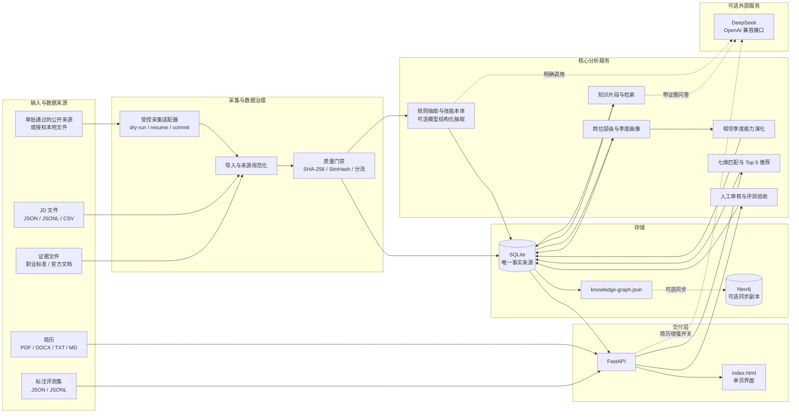
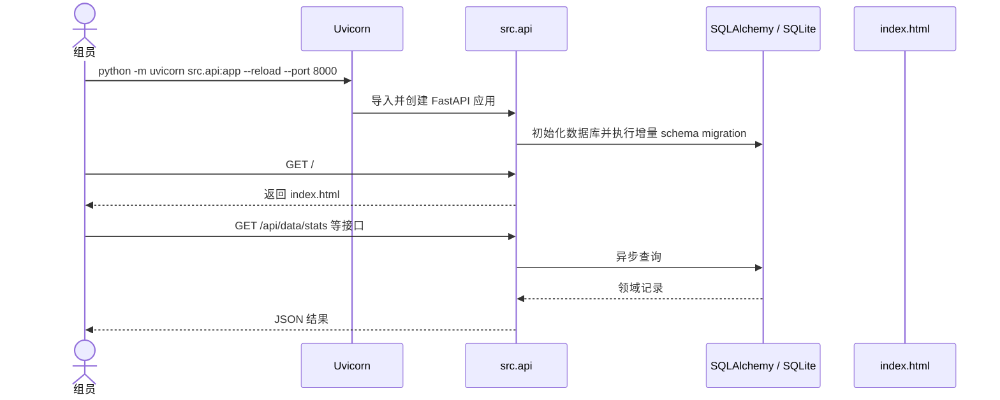
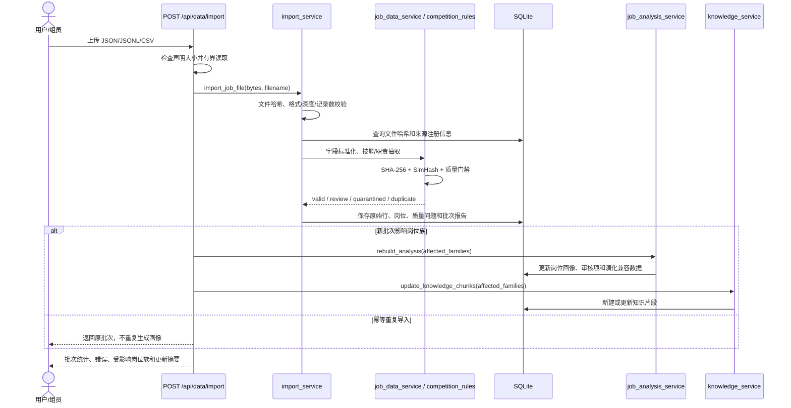
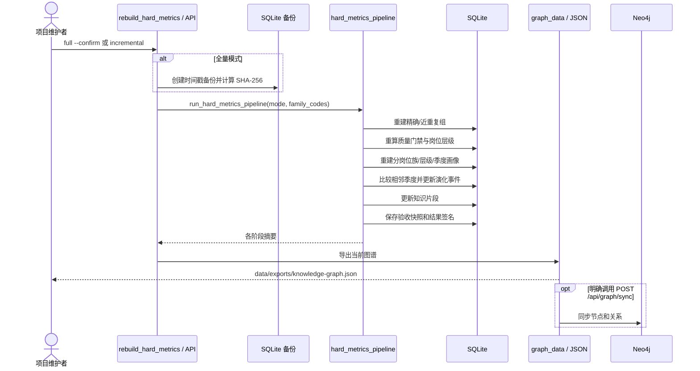
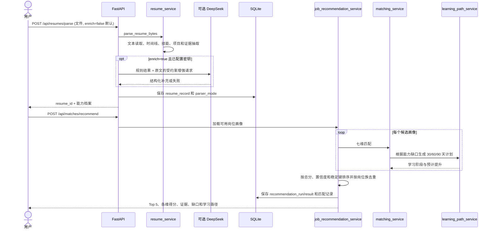
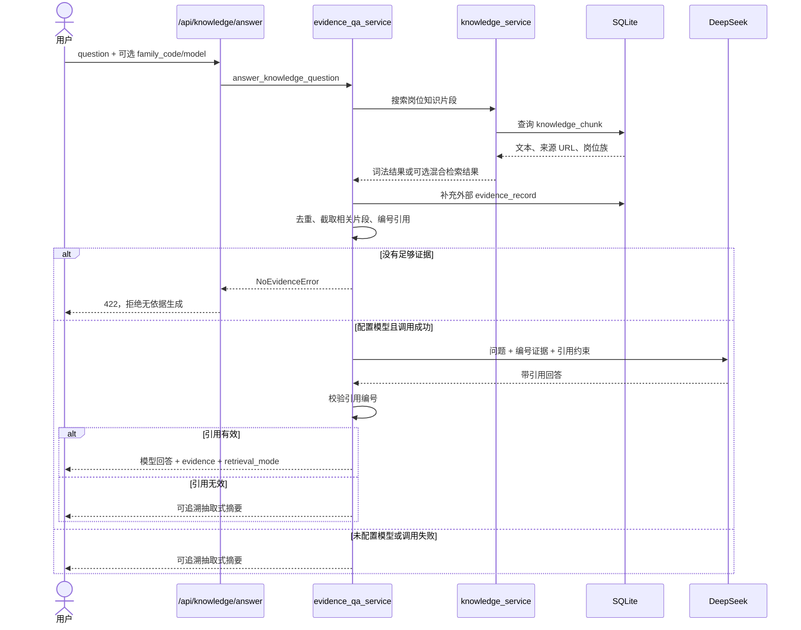
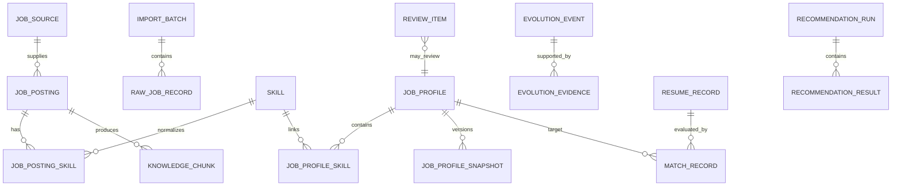

# 系统架构与代码运行流程

本文从“组件如何协作”和“请求如何流动”两个角度解释项目。第一次接触代码的组员可先看总体架构，再按需要定位到具体服务文件。

## 一、总体架构

架构中最重要的边界是：

- SQLite 是业务数据、证据、画像、匹配和验收的唯一事实来源。
- Neo4j 是可选的图存储副本；不可用时全景图谱和 JSON 导出仍可工作。
- DeepSeek 只用于明确启用的增强路径；规则解析、质量治理、确定性匹配和词法检索不依赖模型。
- 单页前端没有 Node.js 构建步骤，由 FastAPI 根路由直接返回 `index.html`。

## 二、运行时分层

| 层级 | 主要路径 | 说明 |
| --- | --- | --- |
| 展示层 | `index.html` | 通过 Fetch 调用 REST API，展示总览、图谱、匹配、审核和评测 |
| 接口层 | `src/api.py` | 参数校验、上传限制、事务入口、异常转 HTTP 状态码 |
| 业务服务层 | `src/*_service.py` | 每个服务处理一个业务能力，如导入、画像、演化、简历或推荐 |
| 采集子系统 | `src/job_collection/` | 来源审批、HTTP 安全、适配器、断点状态、分流和提交 |
| 领域模型层 | `model_class/` | SQLAlchemy 表定义与关系字段 |
| 输入模型层 | `schemes/job_competency.py` | FastAPI 请求体的 Pydantic 校验 |
| 配置层 | `src/app_config.py`、`config/DB_config.py`、`config/*.json` | 环境变量、数据库连接、岗位族和来源规则 |
| 持久化层 | `data/job_competency.db` | 默认本地 SQLite 主库；不会上传到 GitHub |

## 三、主要入口与文件职责

### 应用与接口

- `src/api.py`：应用工厂和全部 HTTP 路由。启动时完成数据库初始化/迁移，`GET /` 返回单页界面。
- `src/main.py`：开发运行入口，等价于启动 `src.api:app`。
- `schemes/job_competency.py`：岗位、证据、匹配、推荐、审核和硬指标请求模型。

### 数据与画像

- `src/import_service.py`：批量导入主入口，负责解析、限制、来源规范化、批次幂等和持久化。
- `src/job_data_service.py`：标准化、哈希、SimHash、技能/职责规则抽取和基础质量分。
- `src/competition_rules.py`：质量门禁、岗位层级和技能变化的确定性规则。
- `src/hard_metrics_pipeline.py`：全量/增量硬指标流水线编排。
- `src/quarterly_profile_service.py`：按岗位族、层级、季度构建画像快照。
- `src/evolution_service.py`：比较相邻季度画像并保存正式演化事件与证据。
- `src/job_analysis_service.py`：基础岗位画像、新岗位候选分数、演化兼容输出和图谱聚合。

### 知识与图谱

- `src/knowledge_service.py`：把岗位内容构造成知识片段，并提供词法或可选混合检索。
- `src/evidence_qa_service.py`：合并岗位与外部证据、构造受约束提示词、校验引用并提供摘要降级。
- `src/job_graph_sync.py`：把 API 图谱负载拆分成节点/关系并同步到 Neo4j。

### 简历、匹配和推荐

- `src/resume_service.py`：从 PDF、DOCX、TXT、Markdown 提取文本和规则能力档案。
- `src/resume_enrichment_service.py`：仅在用户启用且密钥存在时调用模型增强，并在失败时回退规则结果。
- `src/matching_service.py`：计算七个匹配维度、分数上限、匹配档位和证据解释。
- `src/job_recommendation_service.py`：加载候选画像、复用匹配逻辑、按岗位族去重并稳定排序。
- `src/learning_path_service.py`：把技能缺口变成 30/60/90 天阶段任务。

### 质量评测

- `src/evaluation_service.py`：解析基准数据并计算 Precision、Recall、F1、Accuracy、MRR、NDCG@5 等指标。
- `src/acceptance_service.py`：组合业务评测、覆盖率、数据量、来源多样性和画像覆盖，形成最低门槛与内部目标状态。
- `src/rebuild_hard_metrics.py`：命令行安全重建，包含确认、备份、哈希校验和修复审计。

## 四、应用启动流程

健康检查 `GET /health` 不依赖 Neo4j 或模型服务，成功时返回服务名、版本和 `status=ok`。

## 五、流程一：JD 导入与质量治理

重要输出：

- `import_batch`：批次级统计和文件哈希；
- `raw_job_record`：每行原始内容与分流状态；
- `job_posting`：标准化岗位及去重/质量状态；
- `quality_issue`：字段或质量问题；
- `data/imports/<batch-id>-report.json`：命令行构建时的批次报告。

## 六、流程二：硬指标重建、季度画像与图谱

流水线顺序固定：重复治理 → 质量门禁 → 季度画像 → 相邻季度演化 → 知识片段 → 验收快照。这样验收数字始终基于同一轮派生状态。

## 七、流程三：简历解析、推荐、匹配与学习路径

单岗位匹配也可通过 `POST /api/matches` 直接对已保存简历和岗位画像计算。敏感属性不参与评分。

## 八、流程四：知识检索与带证据回答

问答的核心不是“模型一定回答”，而是“没有证据则拒绝，有证据则返回可核查来源”。

## 九、数据库中的核心实体

实际模型还包含职责、行业场景、采集运行、修复审计、评测运行和验收快照。完整字段以 `model_class/job_competency.py` 与 `model_class/knowledge_base.py` 为准。

## 十、常用调用入口

| 目的 | 入口 |
| --- | --- |
| 启动系统 | `python -m uvicorn src.api:app --reload --port 8000` |
| 从本地 JD 构建知识库 | `python -m src.build_knowledge_base <岗位文件>` |
| 只读检查硬指标 | `python -m src.rebuild_hard_metrics --dry-run` |
| 确认全量重建 | `python -m src.rebuild_hard_metrics --full --confirm` |
| 受控采集试运行 | `python -m src.collect_jobs --source <source> --run-id <id> --dry-run ...` |
| 完整自动化测试 | `python -m pytest -c pytest-full.ini -q` |
| API 交互文档 | `http://127.0.0.1:8000/docs` |

环境与故障处理见 [环境配置与部署](ENVIRONMENT_AND_DEPLOYMENT.md)，数据格式和评分逻辑见 [输入输出、模型与算法](INPUT_OUTPUT_AND_ALGORITHMS.md)。
